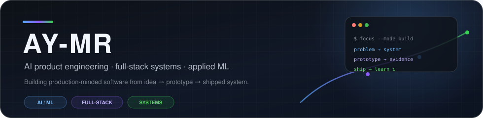
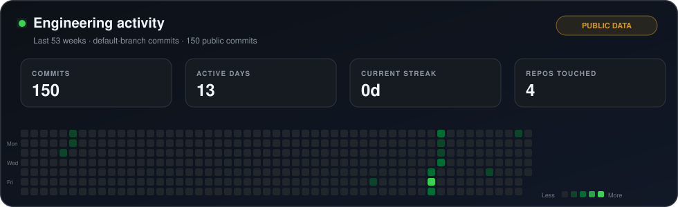

  
    
  
  
  

## What I build

I’m a student engineer focused on turning **AI/ML ideas into usable software systems** — from model experiments and local-first tooling to mobile/web products that can actually be tested, shipped, and improved.

`AI product engineering` · `full-stack systems` · `developer tooling` · `local-first software` · `applied ML`

- **AI products:** model-backed workflows, intelligent automation, evaluation, and human-in-the-loop product design.
- **Software systems:** end-to-end mobile/web/backend implementation with a production mindset rather than demo-only prototypes.
- **Applied ML & edge computing:** computer vision, embedded devices, and practical inference under real hardware constraints.

## Selected work

| Project | What it solves | Core stack |
| --- | --- | --- |
| **[DeskGraph](https://github.com/masddffee/DeskGraph)** | A privacy-first, local computer context graph that lets AI agents search narrowly authorized local context without uploading file data by default. | Rust · Tauri · SQLite · local-first architecture |
| **[Google Play Preflight Skills](https://github.com/masddffee/google-play-preflight-skills)** | A policy-aware preflight skill for AI coding agents that catches likely Android / Expo / React Native / Flutter review blockers before Play Store submission. | Agent tooling · Android policy · Expo / React Native |
| **[Smart Microwave Oven](https://github.com/masddffee/Smart-microwave-oven)** | Contactless microwave input using computer vision, Raspberry Pi hardware control, and on-device ML-oriented inference. | Python · TensorFlow / Keras · OpenCV · Raspberry Pi |

## Core stack

  
  
  
  
  
  
  
  
  
  
  

## Engineering activity

  

  Automatically refreshed from GitHub API data. When private-repository access is configured, this card aggregates public + private default-branch commits while never rendering private repository names or commit messages.

---

Build → measure → ship → learn.

